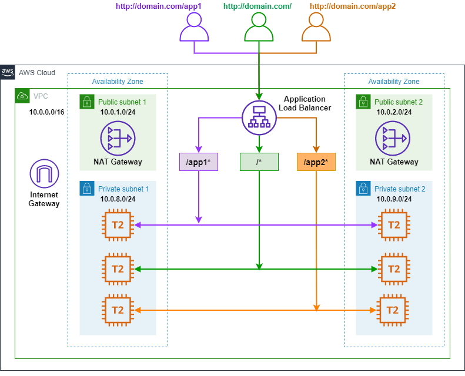
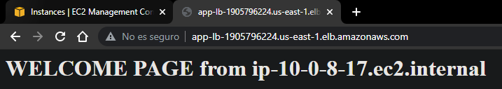
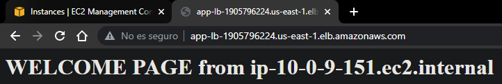
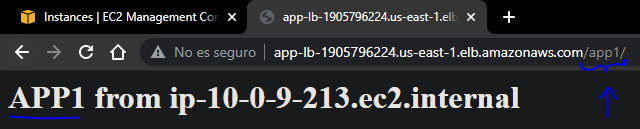
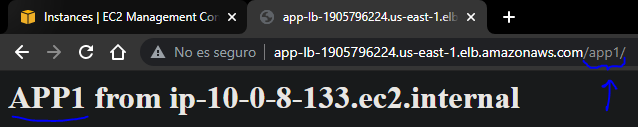
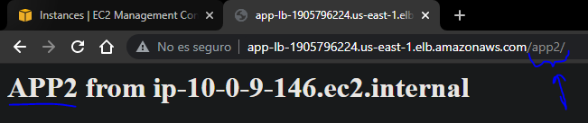
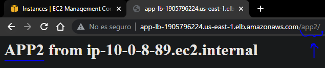

# Terraform AWS ALB Path Based Routing

## Descripcion

- La Arquitectura consiste en un `enrutamiento basado en rutas`
- Cuando se coloque la direccion DNS del ALB en un navegador y dependiendo de la ruta que se le agregue, se redireccionara hacia ciertos sitios web
- Se tienen 3 rutas: `/`, `/app1/` y `app2`
- Para cada ruta se hara el balanceo de carga entre dos instancias que se encuentran repartidas entre las dos subnets privadas

## Arquitectura

La Arquitectura esta diseñada e implementada en 2 AZs y consta de los siguientes recursos:

- 1 Internet Gateway
- 2 NAT Gateway
- 2 Subnets publicas
- 2 Subnets privadas
- 6 Instancias t2.micro
- 1 Application Load Balancer



## Uso
- Para crear la infraestrutura debemos ejecutar los siguientes comandos:
```t
terraform init
terraform validate 
terraform plan
terraform apply -auto-approve
```

# Archivos

## Provider

```t
terraform {
  required_providers {
    aws = {
      source  = "hashicorp/aws"
      version = "~>3.49"
    }
  }
}
provider "aws" {
  profile = "default"
  region  = "us-east-1"
}
```

## 01 - Vpc

```t
resource "aws_vpc" "vpc" {
  cidr_block = "${var.cidr_vpc}"

  tags = {
    Name = "custom-vpc"
  }
}
```
## 02 - Vars Vpc

```t
variable "cidr_vpc" {
  type      = string
  default   = "10.0.0.0/16"
}

variable "azs" {
  type      = list(string)
  default   = [ "us-east-1b", "us-east-1d"  ]
}

variable "pub-subnets" {
  type      = list(string)
  default   = [ 
      "10.0.1.0/24",
      "10.0.2.0/24"
   ] 
}

variable "priv-subnets" {
  type      = list(string)
  default   = [ 
      "10.0.8.0/24",
      "10.0.9.0/24"
   ] 
}
```

## 03 - Subnets

```t
resource "aws_subnet" "pub-subnets" {
  count             = "${length(var.azs)}"
  vpc_id            = aws_vpc.vpc.id
  cidr_block        = "${element(var.pub-subnets, count.index)}"
  availability_zone = "${element(var.azs, count.index)}"
  map_public_ip_on_launch = true

  tags = {
    Name = "pub-subnet-${count.index}"
  }
}

resource "aws_subnet" "priv-subnets" {
  count             = "${length(var.azs)}"
  vpc_id            = aws_vpc.vpc.id
  cidr_block        = "${element(var.priv-subnets, count.index)}"
  availability_zone = "${element(var.azs, count.index)}"
  map_public_ip_on_launch = false

  tags = {
    Name = "priv-subnet-${count.index}"
  }
}   
```

## 04 - Internet Gateway

```t
resource "aws_internet_gateway" "i-gateway" {
  vpc_id = aws_vpc.vpc.id

  tags = {
    Name = "custom-igtw"
  }
}
```

## 05 - NAT Gateway

```t
resource "aws_eip" "e-ip" {
  count = "${length(var.azs)}"
  vpc   = true
  depends_on = [
    aws_internet_gateway.i-gateway
  ]

  tags = {
    Name = "eip-${count.index}"
  }
}

resource "aws_nat_gateway" "nat-gtw" {
  count         = "${length(var.azs)}"
  allocation_id = "${aws_eip.e-ip[count.index].id}"
  subnet_id     = "${aws_subnet.pub-subnets[count.index].id}"
  connectivity_type = "public"
  depends_on = [
    aws_internet_gateway.i-gateway
  ]

  tags = {
    Name = "nat-g-${count.index}"
  }
}
```

## 06 - Route Tables

```t
# TABLE FOR PUBLIC SUBNETS
resource "aws_route_table" "pub-table" {
  vpc_id    = "${aws_vpc.vpc.id}"
}

resource "aws_route" "pub-route" {
  route_table_id         = "${aws_route_table.pub-table.id}"
  destination_cidr_block = "0.0.0.0/0"
  gateway_id             = "${aws_internet_gateway.i-gateway.id }"
}

resource "aws_route_table_association" "as-pub" {
  count          = "${length(var.pub-subnets)}"
  route_table_id = "${aws_route_table.pub-table.id}"
  subnet_id      = "${aws_subnet.pub-subnets[count.index].id}"  
}
# TABLEs FOR PRIVATE SUBNETS
resource "aws_route_table" "priv-table" {
  count  = "${length(var.priv-subnets)}"
  vpc_id = "${aws_vpc.vpc.id}"  
}

resource "aws_route" "priv-route" {
  count                  = "${length(var.priv-subnets)}"
  route_table_id         = "${aws_route_table.priv-table[count.index].id}" 
  destination_cidr_block = "0.0.0.0/0"
  nat_gateway_id         = "${aws_nat_gateway.nat-gtw[count.index].id}"
}

resource "aws_route_table_association" "as-priv" {
  count          = "${length(var.priv-subnets)}"
  route_table_id = "${aws_route_table.priv-table[count.index].id}" 
  subnet_id      = "${aws_subnet.priv-subnets[count.index].id}"
}
```

## 07 - Security Groups

```t
locals {
  ports = [22, 80]
}

resource "aws_security_group" "allow_tls" {
  name        = "allow_tls"
  description = "Allow TLS traffic"
  vpc_id      = "${aws_vpc.vpc.id}"

  dynamic "ingress" {
    for_each = local.ports
    content {
      description      = "Allow ssh-http"
      from_port        = ingress.value
      to_port          = ingress.value
      protocol         = "tcp"
      cidr_blocks      = ["0.0.0.0/0"]
      ipv6_cidr_blocks = ["::/0"]
    }
  }

  egress {
    from_port        = 0
    to_port          = 0
    protocol         = "-1"
    cidr_blocks      = ["0.0.0.0/0"]
    ipv6_cidr_blocks = ["::/0"]
  }

  tags = {
    Name = "allow_tls"
  }
}
```

## 08 - EC2 Instances

```t
resource "aws_instance" "app1-instances" {
  count             = "${length(var.azs)}"
  ami               = "ami-0aeeebd8d2ab47354"
  instance_type     = "t2.micro"
  availability_zone = element(var.azs, count.index)
  subnet_id         = aws_subnet.priv-subnets[count.index].id
  vpc_security_group_ids = [aws_security_group.allow_tls.id]
  user_data         = file("bash-scripts/http1.sh")

  tags = {
    Name = "app1-${element(var.azs, count.index)}"
  }
}

resource "aws_instance" "init-instances" {
  count             = "${length(var.azs)}"
  ami               = "ami-0aeeebd8d2ab47354"
  instance_type     = "t2.micro"
  availability_zone = element(var.azs, count.index)
  subnet_id         = aws_subnet.priv-subnets[count.index].id
  vpc_security_group_ids = [aws_security_group.allow_tls.id]
  user_data         = file("bash-scripts/http2.sh")

  tags = {
    Name = "init-${element(var.azs, count.index)}"
  }
}

resource "aws_instance" "app2-instances" {
  count             = "${length(var.azs)}"
  ami               = "ami-0aeeebd8d2ab47354"
  instance_type     = "t2.micro"
  availability_zone = element(var.azs, count.index)
  subnet_id         = aws_subnet.priv-subnets[count.index].id
  vpc_security_group_ids = [aws_security_group.allow_tls.id]
  user_data         = file("bash-scripts/http3.sh")

  tags = {
    Name = "app2-${element(var.azs, count.index)}"
  }
}
```

## Bash Scripts
#### http1.sh

```t
#!/bin/bash
sudo yum update -y
sudo yum install httpd -y
sudo systemctl enable httpd
sudo systemctl start httpd
sudo mkdir /var/www/html/app1
echo "<h1>APP1 from $(hostname -f)</h1>" > /var/www/html/app1/index.html
```

#### http2.sh

```t
#!/bin/bash
sudo yum update -y
sudo yum install httpd -y
sudo systemctl enable httpd
sudo systemctl start httpd
echo "<h1>WELCOME PAGE from $(hostname -f)</h1>" > /var/www/html/index.html
```

#### http3.sh

```t
#!/bin/bash
sudo yum update -y
sudo yum install httpd -y
sudo systemctl enable httpd
sudo systemctl start httpd
sudo mkdir /var/www/html/app2
echo "<h1>APP2 from $(hostname -f)</h1>" > /var/www/html/app2/index.html
```

## 09 - Application Load Balancer

```t
resource "aws_lb" "alb" {
    name        = "app-lb"
    internal    = false
    load_balancer_type  = "application"
    security_groups     = [aws_security_group.allow_tls.id] 
    subnets             = "${aws_subnet.pub-subnets[*].id}"
}

resource "aws_lb_target_group" "tg-groups" {
  count     = 3
  name      = "tg-group-${element(var.app-type, count.index)}"
  port      = 80
  protocol  = "HTTP"
  vpc_id    = "${aws_vpc.vpc.id}"

  health_check {
    enabled             = true
    interval            = 30
    path                = "${element(var.app-routes, count.index)}"
    port                = "traffic-port"
    protocol            = "HTTP"
    healthy_threshold   = 3
    unhealthy_threshold = 3
    timeout             = 6
    matcher             = "200-399"
  }
}

resource "aws_lb_target_group_attachment" "tg-attach-app1" {
  count                 = "${length(var.priv-subnets)}"
  target_group_arn      = "${aws_lb_target_group.tg-groups[0].id}"
  target_id             = "${aws_instance.app1-instances[count.index].id}"
  port                  = 80
}

resource "aws_lb_target_group_attachment" "tg-attach-init" {
  count                 = "${length(var.priv-subnets)}"
  target_group_arn      = "${aws_lb_target_group.tg-groups[1].id}"
  target_id             = "${aws_instance.init-instances[count.index].id}"
  port                  = 80
}

resource "aws_lb_target_group_attachment" "tg-attach-app2" {
  count                 = "${length(var.priv-subnets)}"
  target_group_arn      = "${aws_lb_target_group.tg-groups[2].id}"
  target_id             = "${aws_instance.app2-instances[count.index].id}"
  port                  = 80
}

resource "aws_lb_listener" "apps-listener" {
  load_balancer_arn = "${aws_lb.alb.arn}"
  port              = "80"
  protocol          = "HTTP"

  default_action {
    type = "forward"

    forward {
      target_group {
        arn = aws_lb_target_group.tg-groups[1].arn
      }
      stickiness {
        duration = 1
      }
    }
  }
}

resource "aws_lb_listener_rule" "app-rules" {
  count             = 3
  listener_arn      = "${aws_lb_listener.apps-listener.arn}"

  action {
    type             = "forward"
    target_group_arn = aws_lb_target_group.tg-groups[count.index].arn
  }
  
  condition {
    path_pattern {
      values = ["${element(var.app-simple-routes, count.index)}"]
    }
  }
}
```

## 9a - Vars ALB

```t
variable "app-type" {
  type = list(string)
  default = [ "app1", "principal", "app2"]
}

variable "app-routes" {
  type = list(string)
  default = [ "/app1/index.html", 
              "/",
              "/app2/index.html",
            ]
}

variable "app-simple-routes" {
  type = list(string)
  default = [ "/app1/", 
              "/",
              "/app2/",
            ]
}

```
## 10 - Outputs

```t
output "alb-dns" {
  value = aws_lb.alb.dns_name
}

output "app1-private-ips" {
  value = aws_instance.app1-instances[*].private_ip
}

output "app2-private-ips" {
  value = aws_instance.app2-instances[*].private_ip
}
```
# RESULTADOS

- Una vez ejecutado el comando `terraform apply -auto-approve` y una vez terminada la creacion de la infraestrutura, se obtienen los `OUTPUTS`, especialmente las IPS privadas de las instancias EC2 y el DNS de ALB

- Ingresamos a un navegador y colocamos en la barra de direcciones el DNS del ALB con la ruta `/` para comprobar el funcionamiento





- Cambiamos a la ruta `/app1/` y comprobamos el funcionamiento





- Finalmente cambiamos a la ruta `/app2/` y comprobamos






